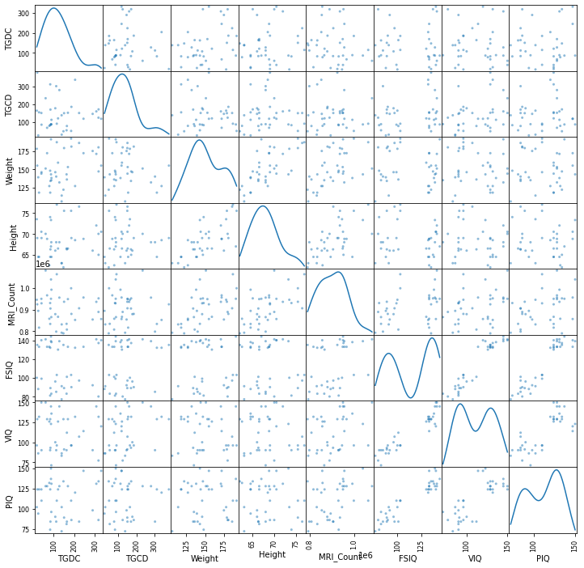
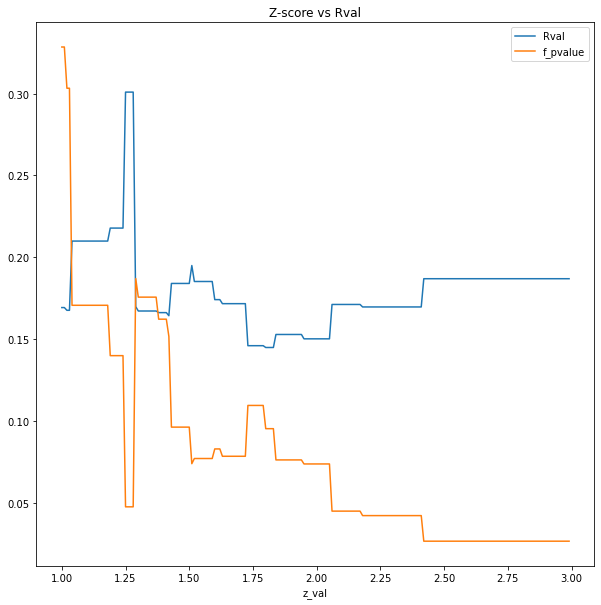

# QLSC-612 Practical assignment

This Jupiter notebook meant to illustrate how not to analyse your data. It is part of the BrainHack course 2020.

Multiples instances of p-hacking are use to get a significant result.


## Install & Run

Follow next steps to run the example script:

1. Clone the repo to your computer:

    `git clone https://github.com/marcelfarres/Farres-M-QLSC612.git`

2. Install conda following [these instructions](https://docs.conda.io/projects/conda/en/latest/user-guide/install/).

3. Create and install conda env running:

    `conda env create --file phacking.yml`
    
4. Activate the env.

    `conda activate phacking`

5. Run the assignment (you can use the notebook or the py script)

    - Script: `python myanalysis.py`

    - Notebook: `jupyter lab myanalysis.ipynb`


## Outputs

`PartY` and `Party2` have been ranamed to Time to Get from the Door to the Chair (TGDC) and Time to Get from the Chair to the Door (TGCD) to improve the narrative.

Figures:

- Scatter matrix using given data + our fictional TGDC and TGCD that allow us to see the distributions of the data `fig/scatter_matrix.png`.


- Plot of the regressors of our model `fig/regressors.png`.


- Explore outlier exclusion criteria. `fig/optimize-z-values.png`


Stats:

- partY

```
                            OLS Regression Results                            
==============================================================================
Dep. Variable:                   TGDC   R-squared:                       0.187
Model:                            OLS   Adj. R-squared:                  0.141
Method:                 Least Squares   F-statistic:                     4.025
Date:                Sun, 31 May 2020   Prob (F-statistic):             0.0267
Time:                        18:42:15   Log-Likelihood:                -219.80
No. Observations:                  38   AIC:                             445.6
Df Residuals:                      35   BIC:                             450.5
Df Model:                           2                                         
Covariance Type:            nonrobust                                         
=================================================================================
                    coef    std err          t      P>|t|      [0.025      0.975]
---------------------------------------------------------------------------------
Intercept       374.6331    172.223      2.175      0.036      25.002     724.264
Weight:Height     0.0211      0.008      2.701      0.011       0.005       0.037
MRI_Count        -0.0005      0.000     -2.239      0.032      -0.001    -4.7e-05
==============================================================================
Omnibus:                        4.297   Durbin-Watson:                   2.536
Prob(Omnibus):                  0.117   Jarque-Bera (JB):                3.134
Skew:                           0.678   Prob(JB):                        0.209
Kurtosis:                       3.375   Cond. No.                     1.18e+07
==============================================================================

```

- partY2

```
                            OLS Regression Results                            
==============================================================================
Dep. Variable:                   TGCD   R-squared:                       0.009
Model:                            OLS   Adj. R-squared:                 -0.047
Method:                 Least Squares   F-statistic:                    0.1677
Date:                Sun, 31 May 2020   Prob (F-statistic):              0.846
Time:                        18:42:21   Log-Likelihood:                -222.11
No. Observations:                  38   AIC:                             450.2
Df Residuals:                      35   BIC:                             455.1
Df Model:                           2                                         
Covariance Type:            nonrobust                                         
=================================================================================
                    coef    std err          t      P>|t|      [0.025      0.975]
---------------------------------------------------------------------------------
Intercept       164.3721    183.016      0.898      0.375    -207.169     535.914
Weight:Height    -0.0045      0.008     -0.536      0.596      -0.021       0.012
MRI_Count      2.861e-05      0.000      0.120      0.905      -0.000       0.001
==============================================================================
Omnibus:                        7.957   Durbin-Watson:                   2.092
Prob(Omnibus):                  0.019   Jarque-Bera (JB):                6.788
Skew:                           0.985   Prob(JB):                       0.0336
Kurtosis:                       3.637   Cond. No.                     1.18e+07
==============================================================================
```